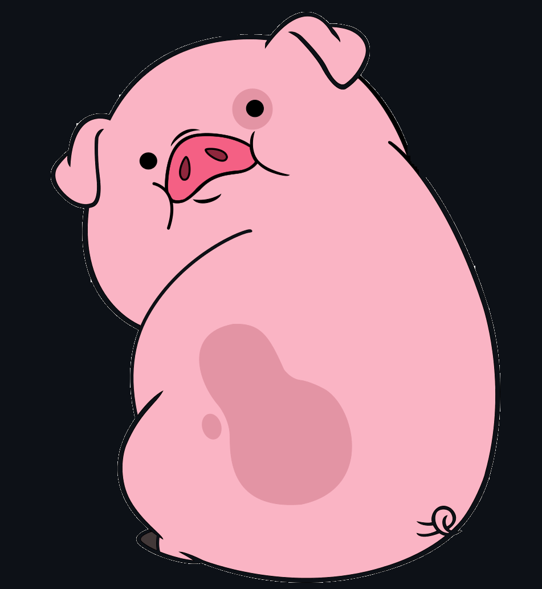

# Pig-Game-App
Just a silly counting game. Still in production! 

## Rules

Get to the 100 first and win! 

- Each player rolls dice and stores total rolled points in the current box;
- In case of rolling 1 player loses all current points and passes the turn;
- Player can hold their current points and transfer them to the total and end their turn.

First player to reach 100 points wins!

All numbers 1-6 are equally probable even tho it feels like 1 appears way too much!

 

 

## Table of Contents
- [Installation](#installation)
- [Usage](#usage)
- [Credits](#credits)
- [License](#license)
- [Collaborators](#Collaborators)

## Installation
Current project has been saved in my personal GitHub repository and is currently available for cloning and reviews on:

https://github.com/Valllerian/Pig-Game-App

## Usage

Access the deployed app on: 

https://valllerian.github.io/Pig-Game-App/

## Credits

Talwind instalation guide: 
 
https://tailwindcss.com/docs/guides/create-react-app

## License
Current project is unlicensed. Which means - "Anyone is free to copy, modify, publish, use, compile, sell, or
distribute this software, either in source code form or as a compiled
binary, for any purpose, commercial or non-commercial, and by any
means." (Quote for source #3)

## Collaborators:

Valerii Bihun: valeriibihun.co@gmail.com;
